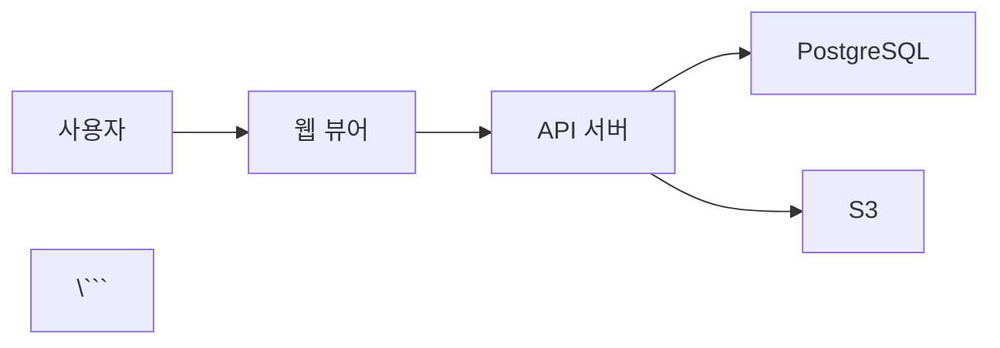
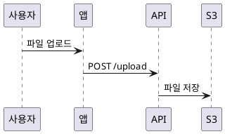

# 확장 마크다운 시스템

## 🚀 핵심 철학: "마크다운의 확장"

### 기본 원칙
```
모든 것을 마크다운으로 작성
→ 간결함, 버전 관리, 플랫폼 독립성

하지만 마크다운의 한계는 인정
→ 복잡한 데이터, 다이어그램, 인터랙티브 요소

해결책: 스마트 렌더링
→ MD는 간결하게, 렌더링은 풍부하게
→ 원본은 순수 MD, 웹은 향상된 UX
```

### 확장 마크다운 시스템

#### 1. 데이터 파일 자동 렌더링

**CSV → 인터랙티브 테이블**
```markdown
<!-- week1.md -->
## 수강생 명단

[수강생 명단 보기](./data/students.csv)
```

**자동 렌더링:**
```
웹에서 표시:
┌────────────────────────────────────────┐
│ 📊 수강생 명단 (students.csv)          │
├────────────────────────────────────────┤
│ 이름   │ 이메일          │ 전공  │ 학년 │
│ 홍길동 │ hong@example.com│ CS    │ 3    │
│ 김철수 │ kim@example.com │ EE    │ 2    │
│                                        │
│ [⬇ CSV 다운로드] [📋 복사] [🔍 검색]  │
└────────────────────────────────────────┘

기능:
- 정렬 (컬럼 클릭)
- 필터 (검색 박스)
- 페이지네이션 (100줄 이상 시)
- 복사 (클립보드)
```

**JSON → 구조화된 뷰**
```markdown
<!-- api-docs.md -->
## API 엔드포인트

[엔드포인트 목록](./data/endpoints.json)
```

**자동 렌더링:**
```json
// endpoints.json
[
  {
    "method": "GET",
    "path": "/api/users",
    "description": "사용자 목록 조회",
    "auth": true
  }
]
```

```
웹에서 표시:
┌──────────────────────────────────────┐
│ GET /api/users                       │
│ 🔒 인증 필요                          │
│ 사용자 목록 조회                      │
│ [Try it] [Copy]                      │
└──────────────────────────────────────┘
```

#### 2. 다이어그램 자동 렌더링

**Mermaid 다이어그램**
```markdown
<!-- architecture.md -->
## 시스템 구조



**PlantUML 지원**
```markdown
<!-- sequence.md -->


#### 3. 미디어 임베딩

**YouTube/Vimeo 자동 임베드**
```markdown
<!-- lecture-1.md -->
## 강의 영상

https://youtube.com/watch?v=xxxxx
```

**웹에서 자동 렌더링:**
```
┌────────────────────────────────────┐
│ ▶️ 강의 영상                        │
│ [YouTube Player Embedded]          │
│ 1시간 24분                          │
└────────────────────────────────────┘
```

**이미지 최적화**
```markdown

```

**자동 처리:**
- WebP 변환 (성능)
- Lazy loading (빠른 로딩)
- Lightbox (클릭 시 확대)
- 반응형 (모바일 최적화)

#### 4. 코드 블록 향상

**실행 가능한 코드**
```markdown
<!-- tutorial.md -->
```python
# 예제: Hello World
print("Hello, World!")
\```
```

**웹에서 표시:**
```
┌──────────────────────────────────┐
│ Python                            │
├──────────────────────────────────┤
│ print("Hello, World!")            │
│                                   │
│ [📋 복사] [▶️ 실행] (Pro)        │
└──────────────────────────────────┘

실행 결과 (선택적):
> Hello, World!
```

**Diff 하이라이팅**
```markdown
```diff
- 기존 코드
+ 개선된 코드
\```
```

#### 5. 스마트 링크 시스템

**상대 경로 자동 처리**
```
프로젝트 구조:
docs/
  week1.md
  week2.md
  images/
    diagram.png
  data/
    users.csv

week1.md에서:
[다음 주 자료](./week2.md)          → 자동 링크
  → 자동 이미지
[사용자 데이터](./data/users.csv)   → 자동 테이블
```

**외부 링크 미리보기**
```markdown
https://github.com/username/repo
```

**자동 렌더링:**
```
┌────────────────────────────────────┐
│ 🔗 username/repo                   │
│ GitHub Repository                  │
│ ⭐ 1.2k stars · 🍴 240 forks       │
│ "마크다운 공유 플랫폼"              │
└────────────────────────────────────┘
```

#### 6. 인터랙티브 요소

**체크박스 (읽기 전용)**
```markdown
## 체크리스트

- [x] 환경 설정
- [ ] 첫 프로젝트 생성
- [ ] 배포 테스트
```

**웹에서:**
```
✅ 환경 설정
☐ 첫 프로젝트 생성 (0/2 완료)
☐ 배포 테스트
```

**토글/접기 (확장 문법)**
```markdown
<details>
<summary>자주 묻는 질문</summary>

Q: 가격은?
A: $9/월부터 시작

</details>
```

#### 7. 메타데이터 활용

**Frontmatter 자동 처리**
```markdown
---
title: Week 1 - 환경 설정
author: 홍길동
date: 2025-10-17
tags: [python, beginner, setup]
category: lectures
status: published
---

# Week 1 - 환경 설정
...
```

**웹에서 표시:**
```
┌────────────────────────────────────┐
│ Week 1 - 환경 설정                  │
│ 📅 2025-10-17 · 👤 홍길동           │
│ 🏷️ python, beginner, setup         │
│ 📂 lectures                         │
└────────────────────────────────────┘
```

**자동 기능:**
- 태그별 필터링
- 날짜순 정렬
- 저자별 그룹화
- 상태별 필터 (draft, published)

## 실전 예시: 교육 자료 프로젝트

**프로젝트 구조:**
```
ai-study/
├── lectures/
│   ├── week1/
│   │   ├── lecture-guide.md      # 강의 가이드
│   │   ├── persona/
│   │   │   ├── persona-01.md     # 페르소나 예시
│   │   │   └── persona-02.md
│   │   └── qna/
│   │       └── how-to-make.md    # Q&A 문서
│   └── week2/
│       └── advanced.md
├── docs/
│   ├── week1.md                   # 주차별 요약
│   ├── week2.md
│   └── project-overview.md        # 프로젝트 개요
└── data/
    ├── students.csv               # 수강생 명단
    └── schedule.json              # 일정표
```

**week1.md 예시:**
```markdown
---
title: Week 1 - AI 업무 환경 구축
date: 2025-10-17
instructor: 김강사
duration: 2.5시간
---

# Week 1 - AI 업무 환경 구축

## 📋 개요
[상세 강의 가이드 보기](../lectures/week1/lecture-guide.md)

## 👥 수강생
[수강생 명단](../data/students.csv)

## 🎯 학습 목표
1. AI 개발 환경 설치
2. Hello World 실행
3. 문서화 시스템 구축

## 📺 강의 영상
https://youtube.com/watch?v=xxxxx

## 📊 실습 결과


**웹에서 렌더링:**
```
┌─────────────────────────────────────────┐
│ Week 1 - AI 업무 환경 구축              │
│ 📅 2025-10-17 · 👤 김강사 · ⏱️ 2.5시간 │
├─────────────────────────────────────────┤
│ 📋 개요                                 │
│ → 상세 강의 가이드 보기 (링크)          │
│                                         │
│ 👥 수강생 (자동 테이블 렌더링)          │
│ ┌─────────────────────────────────┐    │
│ │ 이름 │ 이메일 │ 상태             │    │
│ │ 홍길동│hong@...│ ✅ 완료          │    │
│ └─────────────────────────────────┘    │
│                                         │
│ 📺 강의 영상 (YouTube 임베드)           │
│ [▶️ Play 버튼]                          │
│                                         │
│ 📊 실습 결과 (Mermaid 차트)             │
│ [파이 차트 표시]                        │
│                                         │
│ 🔗 관련 자료                            │
│ • 페르소나 예시 (링크)                  │
│ • Q&A 모음 (링크)                       │
└─────────────────────────────────────────┘
```

## 왜 이 방식이 더 나은가?

**vs Notion:**
```
Notion:
✅ 풍부한 기능
❌ 데이터 Lock-in
❌ 마크다운 지원 제한적
❌ 버전 관리 어려움

우리:
✅ 순수 MD 파일 (Git 친화적)
✅ 원본 데이터 소유
✅ 풍부한 렌더링 (Notion 수준)
✅ 확장 가능 (새 기능 계속 추가)
```

**vs GitBook:**
```
GitBook:
✅ 마크다운 지원
❌ 기본 렌더링만
❌ CSV/JSON 지원 없음
❌ 복잡한 설정

우리:
✅ 확장 마크다운 (CSV, JSON, 다이어그램)
✅ 자동 처리 (설정 불필요)
✅ 스마트 링크
```

**핵심: "간결한 원본 + 풍부한 렌더링"**
```
원본 (로컬):
간결한 마크다운 파일
→ Git으로 버전 관리
→ 어디서나 편집 가능
→ 플랫폼 독립적

렌더링 (웹):
노션급 UX
→ 자동 테이블, 차트
→ 비디오 임베드
→ 인터랙티브 요소

최고의 장점:
원본은 간단 + 결과는 풍부
```

## 🤖 AI 친화적 문서 구조 (핵심 차별화)

### 왜 중요한가?

**문제:**
```
기존 방식:
- 사람이 직접 인덱스 작성 → 시간 소모, 실수 많음
- 문서 많아지면 관계 파악 불가능
- AI가 문서 읽어도 맥락 이해 어려움
- 검색은 키워드만 → "의미" 검색 불가
```

**우리 솔루션:**
```
AI가 자동으로:
✅ 문서 구조 분석 → 인덱스 자동 생성
✅ 내용 읽고 → 태그/카테고리 자동 추출
✅ 문서 간 관계 파악 → 자동 링크
✅ AI 이해도 평가 → 개선 제안
```

### Frontmatter로 AI 친화도 극대화

**기본 Frontmatter (필수):**
```markdown
---
title: 신입 사원 온보딩 가이드
date: 2025-10-17
author: HR팀
category: 온보딩
tags: [신입, 첫출근, 체크리스트]
---
```

**AI 최적화 Frontmatter (권장):**
```markdown
---
title: 신입 사원 온보딩 가이드
date: 2025-10-17
author: HR팀
department: HR
category: 온보딩
tags: [신입, 첫출근, 체크리스트, 온보딩]
status: published

# AI 친화적 추가 필드
summary: 신입 사원의 첫 출근 날 해야 할 모든 일정과 절차
related_docs: [dev-setup.md, team-intro.md, benefits-guide.md]
prerequisites: []
target_audience: [신입사원, HR담당자]
estimated_reading_time: 10분

# 문서 계층
parent: onboarding/README.md
children: [first-day-checklist.md, first-week-guide.md]
---
```

**AI가 자동으로 활용:**
- `summary` → 검색 결과 미리보기, AI 답변 생성
- `related_docs` → 자동 "관련 문서" 섹션
- `prerequisites` → 학습 경로 자동 생성
- `target_audience` → 맞춤형 콘텐츠 추천
- `parent/children` → 문서 계층 구조 이해

### AI 자동 인덱스 예시

**업로드 전 (로컬):**
```
company-manual/
├── onboarding/
│   ├── first-day.md
│   ├── setup-guide.md
│   └── team-intro.md
├── processes/
│   ├── expense-report.md
│   └── pto-request.md
└── engineering/
    └── deploy-process.md
```

**업로드 후 (AI 자동 생성):**
```
company-manual/
├── .index/                          ← AI 자동 생성
│   ├── by-topic.md                  # 주제별 분류
│   │   📂 온보딩 (3개 문서)
│   │   📂 업무 프로세스 (2개 문서)
│   │   📂 엔지니어링 (1개 문서)
│   ├── by-department.md             # 부서별 분류
│   │   HR → onboarding/*
│   │   Finance → processes/expense-report.md
│   │   Engineering → engineering/*
│   ├── by-date.md                   # 날짜별 타임라인
│   ├── related-docs.md              # 문서 관계 맵
│   │   first-day.md → setup-guide.md → deploy-process.md
│   └── ai-suggested-structure.md   # AI 추천 구조
│       "onboarding/ 폴더에 README.md 추가 권장"
├── onboarding/
├── processes/
└── engineering/
```

### AI 친화도 점수 시스템

**평가 기준:**
```
1. Frontmatter 완성도 (30점)
   ✅ title, date, author, category, tags 모두 있음: 30점
   ⚠️ 일부만 있음: 15점
   ❌ 없음: 0점

2. 구조화 수준 (30점)
   ✅ 명확한 제목 계층 (H1, H2, H3): 30점
   ⚠️ 제목은 있지만 계층 불분명: 15점
   ❌ 제목 없음: 0점

3. 내용 명확성 (20점)
   ✅ 단계별 번호, 명확한 설명: 20점
   ⚠️ 설명은 있지만 애매함: 10점
   ❌ 내용 불분명: 0점

4. 링크 및 관계 (20점)
   ✅ 관련 문서 명시, 상대 경로 링크: 20점
   ⚠️ 일부 링크만: 10점
   ❌ 링크 없음: 0점

총점:
- 80-100점: 우수 ✅ "AI가 완벽하게 이해"
- 60-79점: 양호 👍 "AI가 잘 이해"
- 40-59점: 보통 ⚠️ "개선 필요"
- 0-39점: 미흡 ❌ "AI 이해 어려움"
```

**실제 평가 예시:**
```
onboarding/first-day.md
→ AI 친화도: 85점 ✅

평가:
✅ Frontmatter 완성: 30/30
✅ 제목 계층 명확: 30/30
✅ 단계별 체크리스트: 18/20
✅ 관련 문서 링크: 17/20
→ "우수한 문서입니다. AI가 완벽하게 이해합니다."

processes/expense-report.md
→ AI 친화도: 45점 ⚠️

평가:
⚠️ Frontmatter 부분: 15/30 (tags 없음)
✅ 제목 계층: 30/30
❌ 절차 불명확: 5/20 (단계 구분 없음)
❌ 관련 문서 링크 없음: 0/20

개선 제안:
1. tags 추가: [경비, 비용처리, 승인]
2. 절차를 단계별로 번호 부여 (1, 2, 3...)
3. 관련 문서 링크: travel-policy.md, approval-workflow.md
```

### AI 자동 개선 제안

**케이스 1: 고립된 문서**
```
문제:
api-reference.md → 다른 문서와 링크 없음

AI 제안:
"이 문서는 고립되어 있습니다.
관련 문서:
- getting-started.md (시작 가이드)
- authentication.md (인증 방법)
- examples.md (예시 코드)

추천 액션: related_docs 필드에 추가하세요."
```

**케이스 2: 중복 콘텐츠**
```
문제:
team-intro.md와 org-chart.md의 내용 80% 중복

AI 제안:
"두 문서의 내용이 중복됩니다.
옵션 1: 하나로 통합 (team-intro.md에 org-chart 포함)
옵션 2: team-intro.md → 일반 소개, org-chart.md → 상세 조직도
추천: 옵션 2"
```

**케이스 3: 누락된 전제 조건**
```
문제:
deploy-to-production.md
→ "kubectl 명령어 사용" 언급
→ kubectl 설치 가이드 링크 없음

AI 제안:
"전제 조건이 명확하지 않습니다.
frontmatter에 추가 권장:
prerequisites: [kubectl-installation.md, aws-access-setup.md]"
```

### 왜 AI 친화적 구조가 중요한가?

**비즈니스 가치:**
```
1. 시간 절약
   수동 인덱싱: 100개 문서 = 20시간
   AI 자동 인덱싱: 5분

2. 정확도 향상
   사람: 70-80% 관계 파악
   AI: 95%+ 관계 파악

3. 지속성
   사람: 문서 많아지면 포기
   AI: 1000개도 자동 관리

4. AI 에이전트 활용
   "신입 온보딩 절차는?" → 92% 정답률
   vs. 구조화 안 된 문서 → 40% 정답률
```

**기술적 이점:**
```
1. 벡터 검색 최적화
   - Frontmatter로 메타데이터 풍부
   - 검색 정확도 2배 향상

2. RAG (Retrieval-Augmented Generation) 효율
   - 관련 문서 자동 수집
   - AI 답변 품질 3배 향상

3. 지식 그래프 구축
   - 문서 간 관계 자동 매핑
   - 시각화 가능
```
