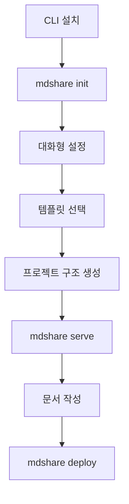
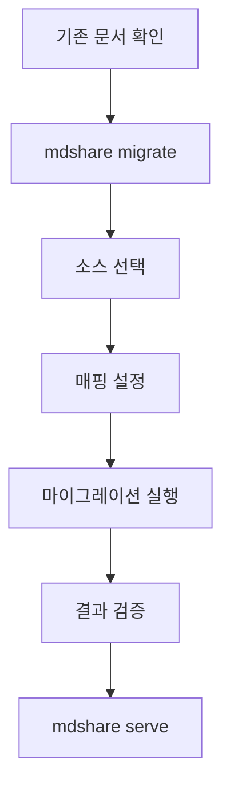
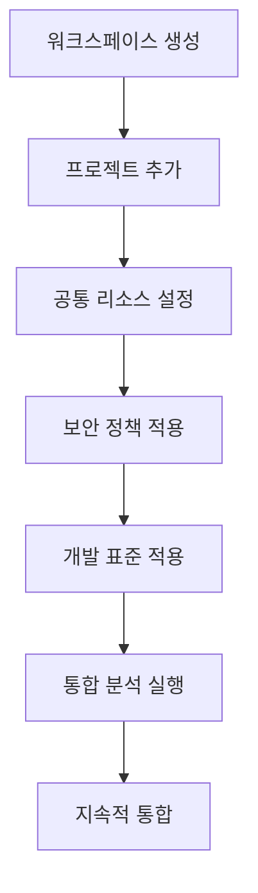

# MDShare CLI 시나리오 설계

## 🎯 전체 시나리오 개요

### 1단계: CLI 도구 설치
```bash
# npm을 통한 전역 설치
npm install -g @mdshare/cli

# 또는 yarn 사용
yarn global add @mdshare/cli

# 설치 확인
mdshare --version
```

### 2단계: 프로젝트 초기화
```bash
# 새 프로젝트 디렉토리에서
mkdir my-documentation
cd my-documentation

# MDShare 프로젝트 초기화
mdshare init
```

### 3단계: 프로젝트 구조 자동 생성
```
my-documentation/                 # 사용자가 생성한 디렉토리
├── 📄 README.md                  # 자동 생성
├── 📄 .mdshare/                  # MDShare 설정 폴더
│   ├── config.json              # 프로젝트 설정
│   ├── index.json               # 메인 인덱스 (초기 빈 상태)
│   └── ai-indexes/              # AI 인덱스 폴더
├── 📁 docs/                      # 문서 폴더
├── 📁 data/                      # 데이터 폴더
├── 📁 assets/                    # 정적 자산 폴더
└── 📁 _meta/                     # 메타데이터 폴더
```

## 🚀 상세 시나리오

### 시나리오 1: 첫 번째 사용자 (신규 프로젝트)

#### 1. CLI 설치 및 초기화
```bash
# 1. CLI 도구 설치
npm install -g @mdshare/cli

# 2. 새 프로젝트 디렉토리 생성
mkdir my-awesome-docs
cd my-awesome-docs

# 3. 프로젝트 초기화
mdshare init

# 대화형 설정 시작
? 프로젝트 이름을 입력하세요: My Awesome Documentation
? 프로젝트 설명을 입력하세요: 내 프로젝트를 위한 문서화 시스템
? 작성자 이름을 입력하세요: 김개발
? 프로젝트 타입을 선택하세요: (Use arrow keys)
  ❯ documentation
    api-docs
    blog
    wiki
    tutorial
    custom

? 언어를 선택하세요: (Use arrow keys)
  ❯ 한국어 (ko)
    English (en)
    일본어 (ja)

? AI 기능을 활성화하시겠습니까? (Y/n) Y
? 자동 인덱싱을 활성화하시겠습니까? (Y/n) Y
? 챗봇 기능을 활성화하시겠습니까? (Y/n) Y

✅ 프로젝트 초기화가 완료되었습니다!
📁 생성된 파일들:
   - README.md
   - .mdshare/config.json
   - .mdshare/index.json
   - docs/ (빈 폴더)
   - data/ (빈 폴더)
   - assets/ (빈 폴더)
   - _meta/ (빈 폴더)

🚀 다음 단계:
   1. mdshare add "문서 제목" - 새 문서 추가
   2. mdshare serve - 로컬 서버 시작
   3. mdshare deploy - 배포
```

#### 2. 생성되는 파일들

**README.md (자동 생성)**
```markdown
---
title: "My Awesome Documentation"
description: "내 프로젝트를 위한 문서화 시스템"
author: "김개발"
category: "overview"
tags: ["documentation", "getting-started"]
difficulty: "beginner"
createdAt: "2024-01-15T10:30:00Z"
updatedAt: "2024-01-15T10:30:00Z"
version: "1.0.0"
status: "published"
---

# My Awesome Documentation

내 프로젝트를 위한 문서화 시스템입니다.

## 📋 프로젝트 개요

이 문서화 프로젝트는 MDShare를 사용하여 구축되었습니다.

## 🚀 빠른 시작

1. [설치 가이드](docs/getting-started/installation.md) - 프로젝트 설치 방법
2. [기본 사용법](docs/getting-started/basic-usage.md) - 사용 방법 학습
3. [API 문서](docs/api/overview.md) - API 사용법

## 📚 문서 구조

### Getting Started
- [설치 가이드](docs/getting-started/installation.md)
- [기본 사용법](docs/getting-started/basic-usage.md)

### API Reference
- [API 개요](docs/api/overview.md)

### Examples
- [예제 모음](docs/examples/)

## 🤖 AI 기능

이 프로젝트는 다음 AI 기능을 지원합니다:

- **자동 인덱싱**: 문서 구조 자동 분석 및 인덱스 생성
- **자동 태깅**: 문서 내용 기반 태그 자동 추출
- **관계 분석**: 문서 간 연관성 자동 파악
- **AI 챗봇**: 문서 기반 질문 답변 시스템

## 📞 지원 및 문의

- **문서**: [MDShare 문서](https://docs.mdshare.app)
- **이슈**: [GitHub Issues](https://github.com/mdshare/mdshare/issues)
- **커뮤니티**: [Discord](https://discord.gg/mdshare)

---

**참고**: 이 문서는 MDShare CLI로 자동 생성되었습니다. 필요에 따라 수정하세요.
```

**config.json (자동 생성)**
```json
{
  "project": {
    "name": "My Awesome Documentation",
    "version": "1.0.0",
    "description": "내 프로젝트를 위한 문서화 시스템",
    "author": "김개발",
    "license": "MIT",
    "language": "ko",
    "createdAt": "2024-01-15T10:30:00Z",
    "updatedAt": "2024-01-15T10:30:00Z",
    "type": "documentation",
    "criticality": "medium"
  },
  "settings": {
    "theme": "default",
    "navigation": "sidebar",
    "searchEnabled": true,
    "aiFeaturesEnabled": true,
    "autoIndexingEnabled": true,
    "chatbotEnabled": true,
    "allowDownload": true,
    "allowComments": false
  },
  "ai": {
    "autoTagging": true,
    "autoCategorization": true,
    "relationshipAnalysis": true,
    "contentSuggestions": true,
    "embeddingModel": "text-embedding-3-small",
    "chatModel": "gpt-4o-mini"
  },
  "access": {
    "visibility": "private",
    "inviteCode": null,
    "allowedDomains": [],
    "passwordProtected": false
  },
  "deployment": {
    "method": "manual",
    "customDomain": null,
    "autoDeploy": false
  }
}
```

### 시나리오 2: 기존 프로젝트 사용자 (템플릿 다운로드)

#### 1. 템플릿 기반 프로젝트 생성
```bash
# 1. 사용 가능한 템플릿 확인
mdshare templates list

# 출력:
# 📋 사용 가능한 템플릿:
#   📚 documentation    - 일반 문서화 프로젝트
#   🔌 api-docs        - API 문서화 프로젝트
#   📝 blog            - 블로그 프로젝트
#   📖 wiki            - 위키 프로젝트
#   🎓 tutorial        - 튜토리얼 프로젝트
#   🏢 enterprise      - 엔터프라이즈 프로젝트 (멀티 프로젝트)

# 2. 템플릿 기반 프로젝트 생성
mdshare init --template api-docs

# 또는 대화형으로
mdshare init
? 프로젝트 타입을 선택하세요:
  ❯ api-docs

? API 문서 유형을 선택하세요: (Use arrow keys)
  ❯ REST API
    GraphQL API
    gRPC API
    WebSocket API

? 인증 방식을 선택하세요: (Use arrow keys)
  ❯ JWT
    API Key
    OAuth 2.0
    Basic Auth

? 샘플 API를 포함하시겠습니까? (Y/n) Y
? OpenAPI 스펙을 생성하시겠습니까? (Y/n) Y

✅ API 문서 프로젝트가 생성되었습니다!
📁 생성된 파일들:
   - README.md
   - .mdshare/config.json
   - docs/api/authentication.md
   - docs/api/endpoints.md
   - docs/examples/
   - data/samples/
   - openapi.yaml
```

#### 2. 생성되는 API 문서 구조
```
api-docs/
├── 📄 README.md
├── 📄 .mdshare/
│   ├── config.json
│   └── index.json
├── 📁 docs/
│   ├── 📁 api/
│   │   ├── authentication.md      # 인증 가이드
│   │   ├── endpoints.md          # API 엔드포인트
│   │   └── examples.md           # 사용 예시
│   └── 📁 getting-started/
│       ├── installation.md       # 설치 가이드
│       └── quick-start.md        # 빠른 시작
├── 📁 data/
│   └── 📁 samples/
│       ├── requests.json         # 요청 샘플
│       └── responses.json        # 응답 샘플
├── 📁 assets/
│   └── 📁 diagrams/
│       └── api-flow.md          # API 플로우 다이어그램
└── 📄 openapi.yaml              # OpenAPI 스펙
```

### 시나리오 3: 엔터프라이즈 사용자 (멀티 프로젝트)

#### 1. 워크스페이스 초기화
```bash
# 1. 워크스페이스 생성
mdshare init --workspace

? 워크스페이스 이름을 입력하세요: 우리 회사 플랫폼
? 워크스페이스 타입을 선택하세요:
  ❯ enterprise-platform
    microservices
    monorepo
    custom

? 포함할 프로젝트를 선택하세요: (Use arrow keys)
  ❯ internal-api
    external-api
    admin-panel
    user-portal
    analytics-service

? 공통 리소스를 포함하시겠습니까? (Y/n) Y
? 보안 정책을 포함하시겠습니까? (Y/n) Y
? 개발 표준을 포함하시겠습니까? (Y/n) Y

✅ 엔터프라이즈 워크스페이스가 생성되었습니다!
📁 생성된 구조:
   - .mdshare-workspace/          # 워크스페이스 설정
   - projects/                    # 개별 프로젝트들
   - shared/                      # 공통 리소스
   - README.md                    # 워크스페이스 개요
```

#### 2. 생성되는 워크스페이스 구조
```
enterprise-workspace/
├── 📄 README.md                           # 워크스페이스 개요
├── 📁 .mdshare-workspace/                 # 워크스페이스 설정
│   ├── workspace.json                     # 워크스페이스 메타데이터
│   ├── cross-project-index.json           # 통합 인덱스
│   └── ai-analysis/                       # AI 분석 결과
├── 📁 projects/                           # 개별 프로젝트들
│   ├── 📁 internal-api/                   # 내부 API 서비스
│   ├── 📁 external-api/                   # 외부 API 서비스
│   ├── 📁 admin-panel/                    # 관리자 패널
│   ├── 📁 user-portal/                    # 사용자 포털
│   └── 📁 analytics-service/              # 분석 서비스
└── 📁 shared/                             # 공통 리소스
    ├── 📁 templates/                      # 공통 템플릿
    ├── 📁 standards/                      # 개발 표준
    ├── 📁 policies/                       # 정책 문서
    └── 📁 guides/                         # 가이드라인
```

## 🛠️ CLI 명령어 체계

### 기본 명령어
```bash
# 프로젝트 초기화
mdshare init                    # 대화형 초기화
mdshare init --template api-docs # 템플릿 기반 초기화
mdshare init --workspace        # 워크스페이스 초기화

# 문서 관리
mdshare add "문서 제목"         # 새 문서 추가
mdshare edit "문서 제목"        # 문서 편집
mdshare list                    # 문서 목록
mdshare search "검색어"         # 문서 검색

# 개발 및 테스트
mdshare serve                   # 로컬 서버 시작
mdshare build                   # 프로젝트 빌드
mdshare test                    # 테스트 실행

# 배포
mdshare deploy                  # 배포
mdshare deploy --staging        # 스테이징 배포
mdshare deploy --production     # 프로덕션 배포

# AI 기능
mdshare index                   # AI 인덱싱 실행
mdshare analyze                 # 프로젝트 분석
mdshare suggest                 # 개선 제안

# 설정 관리
mdshare config                  # 설정 확인
mdshare config set key value    # 설정 변경
mdshare templates list          # 템플릿 목록
mdshare templates install name  # 템플릿 설치
```

### 고급 명령어
```bash
# 프로젝트 관리
mdshare workspace create        # 새 워크스페이스 생성
mdshare project add name        # 워크스페이스에 프로젝트 추가
mdshare project remove name     # 워크스페이스에서 프로젝트 제거

# 통합 분석
mdshare analyze cross-project   # 프로젝트 간 관계 분석
mdshare analyze dependencies    # 의존성 분석
mdshare analyze impact feature  # 기능 영향도 분석

# 마이그레이션
mdshare migrate from-notion     # Notion에서 마이그레이션
mdshare migrate from-gitbook    # GitBook에서 마이그레이션
mdshare migrate from-confluence # Confluence에서 마이그레이션
```

## 🔄 워크플로우

### 1. 신규 프로젝트 워크플로우


### 2. 기존 프로젝트 마이그레이션 워크플로우


### 3. 엔터프라이즈 워크플로우


## 📊 사용자 피드백 수집

### 초기화 후 피드백 요청
```bash
✅ 프로젝트 초기화가 완료되었습니다!

📊 사용자 경험 개선을 위해 피드백을 수집합니다:
? 이 과정이 도움이 되었나요? (1-5) 5
? 가장 유용했던 기능은? (Use arrow keys)
  ❯ 자동 템플릿 생성
    대화형 설정
    AI 기능 설정
    프로젝트 구조

? 개선하고 싶은 부분이 있다면 알려주세요:
> 더 많은 템플릿이 있으면 좋겠어요

? 이 도구를 다른 사람에게 추천하시겠습니까? (Y/n) Y

🙏 피드백 감사합니다! 계속해서 더 나은 도구를 만들어가겠습니다.
```

## 🎯 성공 지표

### 사용자 경험 지표
- **초기화 성공률**: 95% 이상
- **평균 초기화 시간**: 2분 이내
- **사용자 만족도**: 4.5/5.0 이상
- **재사용률**: 80% 이상

### 기술 지표
- **CLI 설치 성공률**: 99% 이상
- **템플릿 다운로드 속도**: 10초 이내
- **프로젝트 생성 성공률**: 98% 이상
- **에러 발생률**: 2% 이하

---

이 CLI 시나리오를 통해 사용자는 **간단한 명령어 하나로 완전한 프로젝트 구조**를 얻을 수 있고, **템플릿 시스템**을 통해 다양한 유형의 프로젝트를 빠르게 시작할 수 있습니다.
