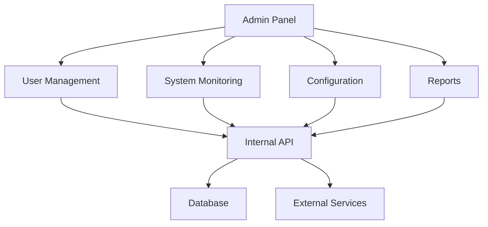

# Admin Panel Documentation

내부 관리자를 위한 관리자 패널 사용 가이드입니다. 이 문서는 시스템 관리, 사용자 관리, 모니터링 등의 기능을 다룹니다.

## 🏗️ 시스템 개요

## 🔧 주요 기능

### 1. 사용자 관리
- 사용자 계정 생성, 수정, 삭제
- 권한 및 역할 관리
- 사용자 활동 모니터링

### 2. 시스템 모니터링
- 실시간 시스템 상태 모니터링
- 성능 지표 및 메트릭
- 알림 및 경고 관리

### 3. 설정 관리
- 시스템 설정 변경
- 환경 변수 관리
- 보안 정책 설정

### 4. 보고서 및 분석
- 사용량 통계
- 성능 분석 보고서
- 보안 감사 로그

## 📚 사용 가이드

### 시작하기
- [관리자 권한 설정](docs/getting-started/permissions.md)
- [초기 설정](docs/getting-started/initial-setup.md)
- [보안 설정](docs/getting-started/security.md)

### 사용자 관리
- [사용자 계정 관리](docs/user-management/accounts.md)
- [권한 및 역할](docs/user-management/permissions.md)
- [사용자 활동 모니터링](docs/user-management/activity.md)

### 시스템 모니터링
- [실시간 모니터링](docs/monitoring/realtime.md)
- [성능 지표](docs/monitoring/performance.md)
- [알림 설정](docs/monitoring/alerts.md)

### 설정 관리
- [시스템 설정](docs/configuration/system.md)
- [보안 정책](docs/configuration/security.md)
- [환경 설정](docs/configuration/environment.md)

### 보고서 및 분석
- [사용량 통계](docs/reports/usage.md)
- [성능 분석](docs/reports/performance.md)
- [보안 감사](docs/reports/security.md)

## 🔗 시스템 의존성

### 의존하는 서비스
- **Internal API**: 핵심 비즈니스 로직 및 데이터

### 사용하는 서비스들
- **Operations Team**: 운영팀
- **Management Team**: 관리팀

## 📊 성능 지표

### 현재 상태
- **응답 시간**: 평균 300ms
- **처리량**: 200 req/sec
- **가용성**: 99.9%
- **에러율**: 0.1%

### 리소스 사용량
- **CPU**: 25%
- **메모리**: 1.2GB
- **디스크**: 5GB
- **네트워크**: 20MB/s

## 🚨 모니터링 및 알림

### 주요 메트릭
- 관리자 로그인 횟수
- 시스템 설정 변경
- 사용자 관리 활동
- 보안 이벤트

### 알림 규칙
- 비정상적인 관리자 활동 감지 시
- 시스템 설정 변경 시
- 보안 위협 감지 시
- 성능 저하 감지 시

## 🔒 보안

### 인증 방식
- 다단계 인증 (MFA) 필수
- IP 화이트리스트
- 세션 타임아웃

### 보안 정책
- 모든 관리자 활동 로깅
- 권한 기반 접근 제어
- 정기적인 보안 감사
- 비밀번호 정책 강화

## 🚀 배포 및 운영

### 배포 환경
- **개발**: admin-dev.company.com
- **스테이징**: admin-staging.company.com
- **프로덕션**: admin.company.com

### CI/CD 파이프라인
1. 코드 커밋
2. 보안 스캔
3. 자동 테스트 실행
4. 빌드 및 이미지 생성
5. 스테이징 배포
6. 보안 테스트
7. 프로덕션 배포

### 백업 및 복구
- **설정 파일**: Git 저장소 관리
- **사용자 데이터**: 매일 자동 백업
- **로그**: 1년 보관

## 🔄 업데이트 계획

### v1.3.0 (예정: 2024-02-01)
- 새로운 모니터링 대시보드
- 고급 보고서 기능
- 사용자 경험 개선

### v2.0.0 (예정: 2024-06-01)
- 새로운 UI/UX 디자인
- 모바일 지원
- AI 기반 분석 기능

## 📞 지원 및 연락처

- **운영팀**: operations@company.com
- **긴급 연락**: +82-10-2345-6789
- **문서**: [Admin Panel 문서](https://docs.company.com/admin-panel)
- **이슈 트래킹**: [Jira](https://company.atlassian.net/browse/ADMIN)

---

**중요**: 관리자 패널은 시스템의 핵심 부분이므로 접근 권한을 엄격하게 관리하고 정기적인 보안 감사를 실시해야 합니다.
