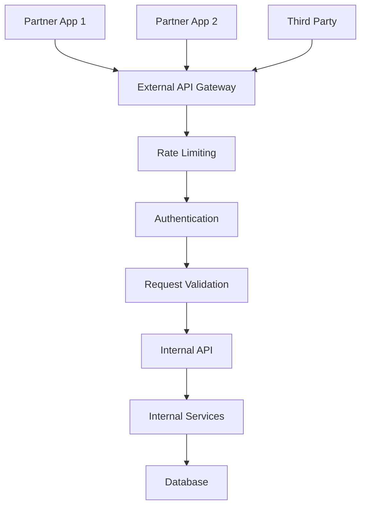

# External API Service

외부 파트너 및 클라이언트를 위한 공개 API 서비스입니다. 이 API는 외부 개발자들이 우리 서비스를 통합할 수 있도록 제공됩니다.

## 🏗️ 아키텍처 개요

## 🔧 핵심 기능

### 1. 파트너 관리
- 파트너 등록 및 인증
- API 키 발급 및 관리
- 사용량 모니터링

### 2. 상품 정보 제공
- 상품 목록 조회
- 상품 상세 정보
- 실시간 재고 정보

### 3. 주문 처리
- 주문 생성 및 관리
- 주문 상태 추적
- 배송 정보 제공

### 4. 웹훅 지원
- 실시간 이벤트 알림
- 주문 상태 변경 알림
- 재고 변경 알림

## 📚 API 문서

### 시작하기
- [API 개요](docs/getting-started/overview.md)
- [인증 설정](docs/getting-started/authentication.md)
- [첫 번째 요청](docs/getting-started/first-request.md)

### 상품 API
- [상품 목록 조회](docs/api/products/list.md)
- [상품 상세 조회](docs/api/products/detail.md)
- [재고 조회](docs/api/products/inventory.md)

### 주문 API
- [주문 생성](docs/api/orders/create.md)
- [주문 조회](docs/api/orders/retrieve.md)
- [주문 상태 업데이트](docs/api/orders/update.md)

### 웹훅 API
- [웹훅 설정](docs/api/webhooks/setup.md)
- [이벤트 타입](docs/api/webhooks/events.md)
- [보안 검증](docs/api/webhooks/security.md)

## 🔗 서비스 의존성

### 의존하는 서비스
- **Internal API**: 핵심 비즈니스 로직 및 데이터

### 사용하는 서비스들
- **Partner Applications**: 파트너사 애플리케이션
- **Third Party Integrations**: 서드파티 통합

## 📊 성능 지표

### 현재 상태
- **응답 시간**: 평균 200ms
- **처리량**: 500 req/sec
- **가용성**: 99.95%
- **에러율**: 0.05%

### 리소스 사용량
- **CPU**: 35%
- **메모리**: 1.8GB
- **디스크**: 8GB
- **네트워크**: 30MB/s

## 🚨 모니터링 및 알림

### 주요 메트릭
- API 요청 수
- 응답 시간
- 에러율
- Rate limit 사용량

### 알림 규칙
- 응답 시간 1초 초과 시
- 에러율 0.1% 초과 시
- Rate limit 90% 초과 시
- 비정상적인 요청 패턴 감지 시

## 🔒 보안

### 인증 방식
- API 키 기반 인증
- OAuth 2.0 (선택적)

### 보안 정책
- Rate limiting: 기본 100 req/min, 프리미엄 1000 req/min
- IP 화이트리스트 지원
- 모든 요청 로깅
- 입력값 검증 및 필터링

## 🚀 배포 및 운영

### 배포 환경
- **개발**: api-external-dev.company.com
- **스테이징**: api-external-staging.company.com
- **프로덕션**: api-external.company.com

### CI/CD 파이프라인
1. 코드 커밋
2. 자동 테스트 실행
3. API 스펙 검증
4. 빌드 및 이미지 생성
5. 스테이징 배포
6. 통합 테스트
7. 프로덕션 배포

### 백업 및 복구
- **API 스펙**: Git 저장소 관리
- **설정 파일**: 환경별 설정 관리
- **로그**: 90일 보관

## 🔄 업데이트 계획

### v1.6.0 (예정: 2024-02-15)
- GraphQL API 추가
- 실시간 알림 기능
- SDK 지원 확대

### v2.0.0 (예정: 2024-04-01)
- 새로운 인증 방식
- 웹훅 기능 강화
- 성능 최적화

## 📞 지원 및 연락처

- **파트너십팀**: partnership@company.com
- **기술 지원**: tech-support@company.com
- **문서**: [External API 문서](https://docs.company.com/external-api)
- **이슈 트래킹**: [GitHub Issues](https://github.com/company/external-api/issues)

---

**중요**: 이 API는 외부 파트너와의 중요한 연결점이므로 안정성과 보안을 최우선으로 고려해야 합니다.
