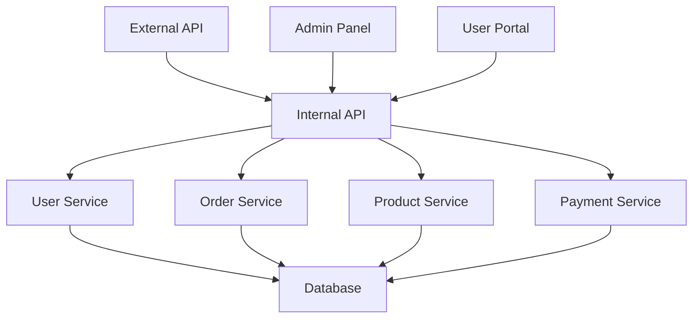

# Internal API Service

핵심 내부 API 서비스의 문서화입니다. 이 서비스는 다른 모든 서비스의 기반이 되는 핵심 API를 제공합니다.

## 🏗️ 아키텍처 개요

## 🔧 핵심 기능

### 1. 사용자 관리
- 사용자 등록, 로그인, 프로필 관리
- 권한 및 역할 관리
- 세션 관리

### 2. 주문 처리
- 주문 생성, 수정, 취소
- 주문 상태 관리
- 결제 연동

### 3. 상품 관리
- 상품 정보 CRUD
- 재고 관리
- 카테고리 관리

### 4. 결제 처리
- 결제 요청 처리
- 결제 상태 관리
- 환불 처리

## 📚 API 문서

### 인증
- [JWT 인증 가이드](docs/api/authentication.md)
- [권한 관리](docs/api/authorization.md)

### 사용자 API
- [사용자 관리](docs/api/user-management.md)
- [프로필 관리](docs/api/profile-management.md)

### 주문 API
- [주문 처리](docs/api/order-processing.md)
- [주문 상태 관리](docs/api/order-status.md)

### 상품 API
- [상품 관리](docs/api/product-management.md)
- [재고 관리](docs/api/inventory-management.md)

### 결제 API
- [결제 처리](docs/api/payment-processing.md)
- [결제 상태 관리](docs/api/payment-status.md)

## 🔗 서비스 의존성

### 의존하는 서비스
- **Database Service**: 데이터 저장 및 관리
- **Auth Service**: 인증 및 권한 관리

### 사용하는 서비스들
- **External API**: 외부 API 서비스
- **Admin Panel**: 관리자 패널
- **User Portal**: 사용자 포털

## 📊 성능 지표

### 현재 상태
- **응답 시간**: 평균 150ms
- **처리량**: 1000 req/sec
- **가용성**: 99.9%
- **에러율**: 0.1%

### 리소스 사용량
- **CPU**: 45%
- **메모리**: 2.1GB
- **디스크**: 15GB
- **네트워크**: 50MB/s

## 🚨 모니터링 및 알림

### 주요 메트릭
- API 응답 시간
- 에러율
- 처리량
- 데이터베이스 연결 상태

### 알림 규칙
- 응답 시간 500ms 초과 시
- 에러율 1% 초과 시
- 처리량 80% 초과 시
- 데이터베이스 연결 실패 시

## 🔒 보안

### 인증 방식
- JWT 토큰 기반 인증
- API 키 인증 (내부 서비스 간)

### 보안 정책
- 모든 요청 로깅
- 입력값 검증 및 필터링
- SQL 인젝션 방지
- XSS 방지

## 🚀 배포 및 운영

### 배포 환경
- **개발**: internal-api-dev.company.com
- **스테이징**: internal-api-staging.company.com
- **프로덕션**: internal-api.company.com

### CI/CD 파이프라인
1. 코드 커밋
2. 자동 테스트 실행
3. 빌드 및 이미지 생성
4. 스테이징 배포
5. 통합 테스트
6. 프로덕션 배포

### 백업 및 복구
- **데이터베이스**: 매일 자동 백업
- **설정 파일**: Git 저장소 관리
- **로그**: 30일 보관

## 🔄 업데이트 계획

### v2.2.0 (예정: 2024-02-01)
- GraphQL API 추가
- 실시간 알림 기능
- 성능 최적화

### v2.3.0 (예정: 2024-03-01)
- 마이크로서비스 분할
- 이벤트 기반 아키텍처
- 캐싱 시스템 개선

## 📞 지원 및 연락처

- **개발팀**: api-team@company.com
- **긴급 연락**: +82-10-1234-5678
- **문서**: [Internal API 문서](https://docs.company.com/internal-api)
- **이슈 트래킹**: [Jira](https://company.atlassian.net/browse/API)

---

**중요**: 이 서비스는 핵심 서비스이므로 변경 시 모든 의존 서비스에 미치는 영향을 반드시 검토해야 합니다.