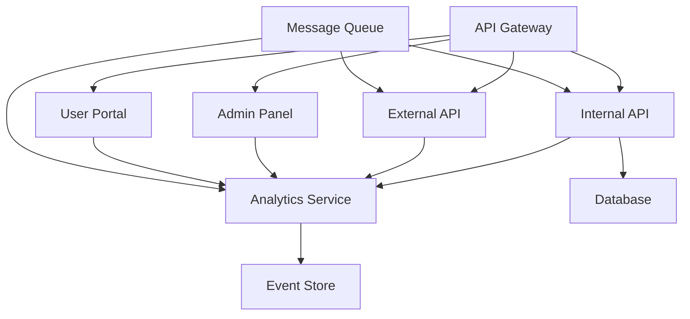

# 서비스 통합 가이드

마이크로서비스 아키텍처에서 서비스 간 통합 및 연동을 위한 종합 가이드입니다.

## 🏗️ 통합 아키텍처 개요

### 1. 통합 패턴


### 2. 통합 계층
- **Presentation Layer**: API Gateway, Load Balancer
- **Application Layer**: 비즈니스 로직, 서비스 레이어
- **Integration Layer**: 메시지 큐, 이벤트 버스
- **Data Layer**: 데이터베이스, 캐시, 스토리지

## 🔗 서비스 간 통신

### 1. 동기 통신 (Synchronous)

#### REST API 통신
```typescript
// 서비스 클라이언트 예시
class UserServiceClient {
  private baseUrl: string;
  private httpClient: HttpClient;
  
  constructor(baseUrl: string) {
    this.baseUrl = baseUrl;
    this.httpClient = new HttpClient({
      timeout: 5000,
      retries: 3,
      circuitBreaker: true
    });
  }
  
  async getUser(userId: string): Promise<User> {
    try {
      const response = await this.httpClient.get(
        `${this.baseUrl}/api/v1/users/${userId}`
      );
      return response.data;
    } catch (error) {
      if (error.status === 404) {
        throw new UserNotFoundError(`User ${userId} not found`);
      }
      throw new ServiceUnavailableError('User service is unavailable');
    }
  }
  
  async createUser(userData: CreateUserRequest): Promise<User> {
    const response = await this.httpClient.post(
      `${this.baseUrl}/api/v1/users`,
      userData
    );
    return response.data;
  }
}
```

#### GraphQL 통신
```typescript
// GraphQL 클라이언트 예시
class GraphQLClient {
  private endpoint: string;
  
  async query(query: string, variables?: any): Promise<any> {
    const response = await fetch(this.endpoint, {
      method: 'POST',
      headers: {
        'Content-Type': 'application/json',
        'Authorization': `Bearer ${this.getToken()}`
      },
      body: JSON.stringify({
        query,
        variables
      })
    });
    
    const result = await response.json();
    
    if (result.errors) {
      throw new GraphQLError(result.errors);
    }
    
    return result.data;
  }
}

// 사용 예시
const userQuery = `
  query GetUser($id: ID!) {
    user(id: $id) {
      id
      name
      email
      orders {
        id
        total
        status
      }
    }
  }
`;

const user = await graphqlClient.query(userQuery, { id: 'user123' });
```

### 2. 비동기 통신 (Asynchronous)

#### 이벤트 기반 통신
```typescript
// 이벤트 발행자
class EventPublisher {
  private messageQueue: MessageQueue;
  
  async publishUserCreated(user: User): Promise<void> {
    const event: UserCreatedEvent = {
      eventType: 'user.created',
      eventId: generateUUID(),
      timestamp: new Date(),
      data: {
        userId: user.id,
        email: user.email,
        name: user.name
      }
    };
    
    await this.messageQueue.publish('user.events', event);
  }
  
  async publishOrderPlaced(order: Order): Promise<void> {
    const event: OrderPlacedEvent = {
      eventType: 'order.placed',
      eventId: generateUUID(),
      timestamp: new Date(),
      data: {
        orderId: order.id,
        userId: order.userId,
        totalAmount: order.total,
        items: order.items
      }
    };
    
    await this.messageQueue.publish('order.events', event);
  }
}

// 이벤트 구독자
class EventSubscriber {
  private messageQueue: MessageQueue;
  
  constructor() {
    this.setupEventHandlers();
  }
  
  private setupEventHandlers(): void {
    // 사용자 생성 이벤트 처리
    this.messageQueue.subscribe('user.events', async (event: UserCreatedEvent) => {
      if (event.eventType === 'user.created') {
        await this.handleUserCreated(event.data);
      }
    });
    
    // 주문 생성 이벤트 처리
    this.messageQueue.subscribe('order.events', async (event: OrderPlacedEvent) => {
      if (event.eventType === 'order.placed') {
        await this.handleOrderPlaced(event.data);
      }
    });
  }
  
  private async handleUserCreated(data: UserCreatedEvent['data']): Promise<void> {
    // 환영 이메일 발송
    await this.emailService.sendWelcomeEmail(data.email, data.name);
    
    // 분석 데이터 수집
    await this.analyticsService.trackEvent('user_registered', {
      userId: data.userId,
      timestamp: new Date()
    });
  }
  
  private async handleOrderPlaced(data: OrderPlacedEvent['data']): Promise<void> {
    // 재고 업데이트
    await this.inventoryService.updateStock(data.items);
    
    // 결제 처리
    await this.paymentService.processPayment(data.orderId, data.totalAmount);
    
    // 분석 데이터 수집
    await this.analyticsService.trackEvent('order_placed', {
      orderId: data.orderId,
      userId: data.userId,
      totalAmount: data.totalAmount
    });
  }
}
```

## 🔄 데이터 동기화

### 1. 이벤트 소싱 (Event Sourcing)
```typescript
// 이벤트 스토어
interface Event {
  eventId: string;
  eventType: string;
  aggregateId: string;
  version: number;
  timestamp: Date;
  data: any;
}

class EventStore {
  async saveEvent(event: Event): Promise<void> {
    // 이벤트를 스토어에 저장
    await this.database.events.insert(event);
    
    // 이벤트 발행
    await this.eventBus.publish(event);
  }
  
  async getEvents(aggregateId: string, fromVersion?: number): Promise<Event[]> {
    let query = this.database.events
      .where('aggregateId', aggregateId)
      .orderBy('version', 'asc');
    
    if (fromVersion !== undefined) {
      query = query.where('version', '>', fromVersion);
    }
    
    return await query.get();
  }
}

// 애그리게이트
class UserAggregate {
  private id: string;
  private version: number;
  private state: UserState;
  
  constructor(id: string, events: Event[]) {
    this.id = id;
    this.version = 0;
    this.state = new UserState();
    
    // 이벤트를 재생하여 상태 복원
    for (const event of events) {
      this.apply(event);
    }
  }
  
  createUser(email: string, name: string): UserCreatedEvent {
    if (this.state.email) {
      throw new Error('User already exists');
    }
    
    const event: UserCreatedEvent = {
      eventId: generateUUID(),
      eventType: 'user.created',
      aggregateId: this.id,
      version: this.version + 1,
      timestamp: new Date(),
      data: { email, name }
    };
    
    this.apply(event);
    return event;
  }
  
  private apply(event: Event): void {
    this.version = event.version;
    
    switch (event.eventType) {
      case 'user.created':
        this.state.email = event.data.email;
        this.state.name = event.data.name;
        this.state.createdAt = event.timestamp;
        break;
      case 'user.updated':
        Object.assign(this.state, event.data);
        this.state.updatedAt = event.timestamp;
        break;
    }
  }
}
```

### 2. CQRS (Command Query Responsibility Segregation)
```typescript
// Command Side (쓰기)
class UserCommandHandler {
  async handleCreateUser(command: CreateUserCommand): Promise<void> {
    const user = new UserAggregate(command.userId);
    const event = user.createUser(command.email, command.name);
    
    await this.eventStore.saveEvent(event);
  }
  
  async handleUpdateUser(command: UpdateUserCommand): Promise<void> {
    const events = await this.eventStore.getEvents(command.userId);
    const user = new UserAggregate(command.userId, events);
    
    const event = user.updateUser(command.changes);
    await this.eventStore.saveEvent(event);
  }
}

// Query Side (읽기)
class UserQueryHandler {
  private readModel: UserReadModel;
  
  async getUser(userId: string): Promise<UserView> {
    return await this.readModel.findById(userId);
  }
  
  async searchUsers(criteria: UserSearchCriteria): Promise<UserView[]> {
    return await this.readModel.search(criteria);
  }
}

// Read Model Projection
class UserProjection {
  async handleUserCreated(event: UserCreatedEvent): Promise<void> {
    await this.database.userViews.insert({
      id: event.aggregateId,
      email: event.data.email,
      name: event.data.name,
      createdAt: event.timestamp,
      version: event.version
    });
  }
  
  async handleUserUpdated(event: UserUpdatedEvent): Promise<void> {
    await this.database.userViews
      .where('id', event.aggregateId)
      .update({
        ...event.data,
        updatedAt: event.timestamp,
        version: event.version
      });
  }
}
```

## 🔧 통합 패턴

### 1. API Gateway 패턴
```typescript
// API Gateway 라우팅
class APIGateway {
  private routes: Map<string, RouteHandler>;
  
  constructor() {
    this.routes = new Map();
    this.setupRoutes();
  }
  
  private setupRoutes(): void {
    // 사용자 관련 요청을 User Service로 라우팅
    this.routes.set('/api/v1/users/*', new UserServiceProxy());
    
    // 주문 관련 요청을 Order Service로 라우팅
    this.routes.set('/api/v1/orders/*', new OrderServiceProxy());
    
    // 관리자 요청을 Admin Service로 라우팅
    this.routes.set('/api/v1/admin/*', new AdminServiceProxy());
  }
  
  async handleRequest(request: Request): Promise<Response> {
    const route = this.findRoute(request.path);
    
    if (!route) {
      return new Response('Not Found', { status: 404 });
    }
    
    // 인증 및 권한 검증
    const authResult = await this.authenticate(request);
    if (!authResult.success) {
      return new Response('Unauthorized', { status: 401 });
    }
    
    // Rate Limiting
    const rateLimitResult = await this.checkRateLimit(request);
    if (!rateLimitResult.allowed) {
      return new Response('Too Many Requests', { status: 429 });
    }
    
    // 요청 라우팅
    return await route.handle(request);
  }
}
```

### 2. Circuit Breaker 패턴
```typescript
class CircuitBreaker {
  private failureThreshold: number = 5;
  private timeout: number = 60000; // 1분
  private resetTimeout: number = 30000; // 30초
  
  private state: 'CLOSED' | 'OPEN' | 'HALF_OPEN' = 'CLOSED';
  private failureCount: number = 0;
  private lastFailureTime: number = 0;
  
  async execute<T>(operation: () => Promise<T>): Promise<T> {
    if (this.state === 'OPEN') {
      if (Date.now() - this.lastFailureTime > this.resetTimeout) {
        this.state = 'HALF_OPEN';
      } else {
        throw new Error('Circuit breaker is OPEN');
      }
    }
    
    try {
      const result = await Promise.race([
        operation(),
        new Promise((_, reject) => 
          setTimeout(() => reject(new Error('Timeout')), this.timeout)
        )
      ]);
      
      this.onSuccess();
      return result as T;
    } catch (error) {
      this.onFailure();
      throw error;
    }
  }
  
  private onSuccess(): void {
    this.failureCount = 0;
    this.state = 'CLOSED';
  }
  
  private onFailure(): void {
    this.failureCount++;
    this.lastFailureTime = Date.now();
    
    if (this.failureCount >= this.failureThreshold) {
      this.state = 'OPEN';
    }
  }
}

// 사용 예시
const circuitBreaker = new CircuitBreaker();

const userService = {
  async getUser(id: string): Promise<User> {
    return await circuitBreaker.execute(async () => {
      const response = await fetch(`/api/v1/users/${id}`);
      if (!response.ok) {
        throw new Error(`HTTP ${response.status}`);
      }
      return await response.json();
    });
  }
};
```

### 3. Saga 패턴
```typescript
// Saga 오케스트레이터
class OrderSaga {
  private steps: SagaStep[] = [
    new ValidateOrderStep(),
    new ReserveInventoryStep(),
    new ProcessPaymentStep(),
    new CreateShipmentStep(),
    new SendNotificationStep()
  ];
  
  async execute(order: Order): Promise<void> {
    const sagaId = generateUUID();
    const context: SagaContext = {
      sagaId,
      order,
      compensationActions: []
    };
    
    try {
      for (const step of this.steps) {
        await step.execute(context);
        context.compensationActions.push(step.getCompensation());
      }
    } catch (error) {
      await this.compensate(context);
      throw error;
    }
  }
  
  private async compensate(context: SagaContext): Promise<void> {
    // 역순으로 보상 실행
    for (let i = context.compensationActions.length - 1; i >= 0; i--) {
      try {
        await context.compensationActions[i].execute(context);
      } catch (error) {
        console.error('Compensation failed:', error);
      }
    }
  }
}

// Saga 스텝 예시
class ProcessPaymentStep implements SagaStep {
  async execute(context: SagaContext): Promise<void> {
    const paymentResult = await this.paymentService.processPayment(
      context.order.id,
      context.order.total
    );
    
    if (!paymentResult.success) {
      throw new Error('Payment processing failed');
    }
    
    context.paymentId = paymentResult.paymentId;
  }
  
  getCompensation(): CompensationAction {
    return {
      execute: async (context: SagaContext) => {
        if (context.paymentId) {
          await this.paymentService.refundPayment(context.paymentId);
        }
      }
    };
  }
}
```

## 📊 모니터링 및 관찰성

### 1. 분산 추적 (Distributed Tracing)
```typescript
import { trace, context, SpanStatusCode } from '@opentelemetry/api';

class TracedService {
  async processOrder(orderId: string): Promise<void> {
    const tracer = trace.getTracer('order-service');
    
    const span = tracer.startSpan('process-order', {
      attributes: {
        'order.id': orderId,
        'service.name': 'order-service'
      }
    });
    
    try {
      await context.with(trace.setSpan(context.active(), span), async () => {
        // 주문 검증
        await this.validateOrder(orderId);
        
        // 재고 확인
        await this.checkInventory(orderId);
        
        // 결제 처리
        await this.processPayment(orderId);
        
        // 배송 준비
        await this.prepareShipment(orderId);
      });
      
      span.setStatus({ code: SpanStatusCode.OK });
    } catch (error) {
      span.setStatus({
        code: SpanStatusCode.ERROR,
        message: error.message
      });
      span.recordException(error);
      throw error;
    } finally {
      span.end();
    }
  }
}
```

### 2. 메트릭 수집
```typescript
import { metrics } from '@opentelemetry/api';

class MetricsCollector {
  private requestCounter = metrics.getMeter('api-service').createCounter('api_requests_total', {
    description: 'Total number of API requests'
  });
  
  private responseTimeHistogram = metrics.getMeter('api-service').createHistogram('api_response_time', {
    description: 'API response time in milliseconds'
  });
  
  private errorCounter = metrics.getMeter('api-service').createCounter('api_errors_total', {
    description: 'Total number of API errors'
  });
  
  recordRequest(method: string, path: string, statusCode: number, responseTime: number): void {
    this.requestCounter.add(1, {
      method,
      path,
      status_code: statusCode.toString()
    });
    
    this.responseTimeHistogram.record(responseTime, {
      method,
      path
    });
    
    if (statusCode >= 400) {
      this.errorCounter.add(1, {
        method,
        path,
        status_code: statusCode.toString()
      });
    }
  }
}
```

## 🧪 통합 테스트

### 1. 계약 테스트 (Contract Testing)
```typescript
// Provider 테스트
describe('User Service Contract', () => {
  it('should provide user data in expected format', async () => {
    const user = await userService.getUser('user123');
    
    expect(user).toMatchSchema({
      type: 'object',
      properties: {
        id: { type: 'string' },
        email: { type: 'string', format: 'email' },
        name: { type: 'string' },
        createdAt: { type: 'string', format: 'date-time' }
      },
      required: ['id', 'email', 'name', 'createdAt']
    });
  });
});

// Consumer 테스트
describe('Order Service Consumer Contract', () => {
  it('should handle user data from user service', async () => {
    // Mock user service response
    nock('http://user-service')
      .get('/api/v1/users/user123')
      .reply(200, {
        id: 'user123',
        email: 'user@example.com',
        name: 'Test User',
        createdAt: '2024-01-01T00:00:00Z'
      });
    
    const order = await orderService.createOrder({
      userId: 'user123',
      items: [{ productId: 'prod1', quantity: 2 }]
    });
    
    expect(order.userName).toBe('Test User');
  });
});
```

### 2. 통합 테스트
```typescript
describe('Order Processing Integration', () => {
  let testContainer: TestContainer;
  
  beforeAll(async () => {
    testContainer = await createTestContainer();
  });
  
  afterAll(async () => {
    await testContainer.cleanup();
  });
  
  it('should process order end-to-end', async () => {
    // 테스트 데이터 준비
    const user = await testContainer.userService.createUser({
      email: 'test@example.com',
      name: 'Test User'
    });
    
    const product = await testContainer.productService.createProduct({
      name: 'Test Product',
      price: 100,
      stock: 10
    });
    
    // 주문 생성
    const order = await testContainer.orderService.createOrder({
      userId: user.id,
      items: [{ productId: product.id, quantity: 2 }]
    });
    
    // 비동기 이벤트 처리 대기
    await waitFor(() => {
      return testContainer.inventoryService.getStock(product.id) === 8;
    });
    
    await waitFor(() => {
      return testContainer.paymentService.getPaymentStatus(order.id) === 'completed';
    });
    
    // 검증
    expect(order.status).toBe('completed');
    expect(order.total).toBe(200);
  });
});
```

---

**중요**: 서비스 통합은 복잡한 과정이므로 충분한 테스트와 모니터링이 필요합니다. 새로운 통합을 추가할 때는 반드시 기존 서비스에 미치는 영향을 분석하고 단계적으로 적용해야 합니다.
