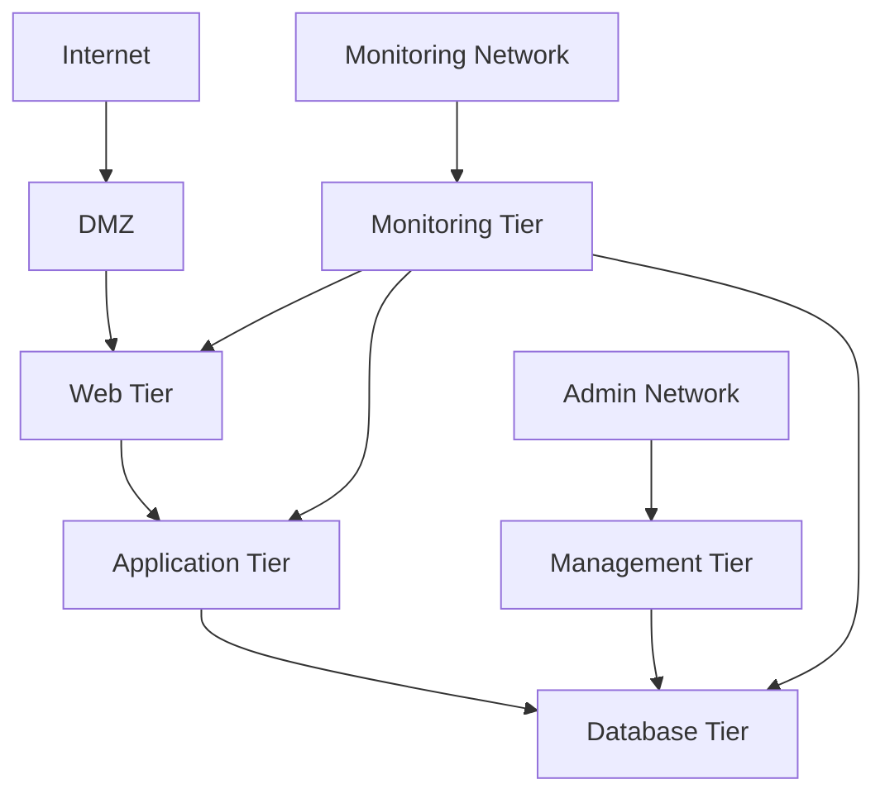
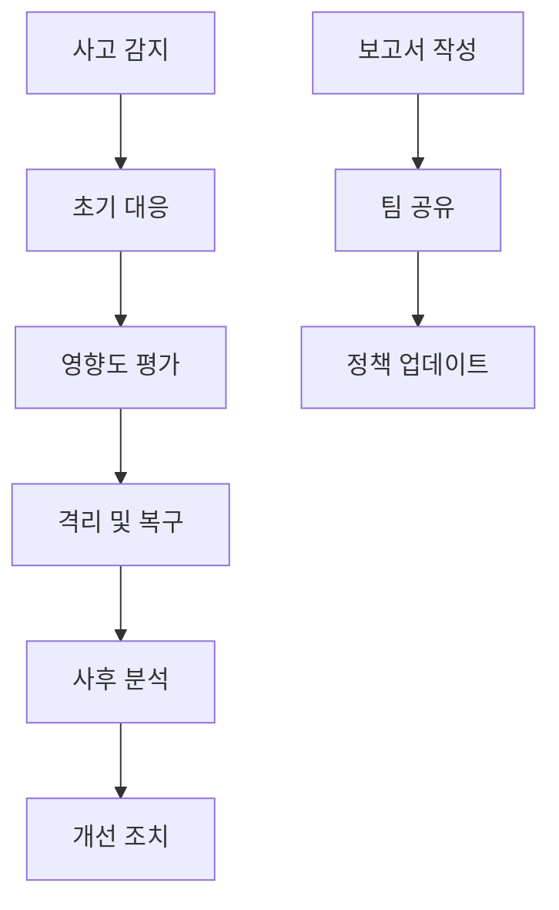

# 보안 정책

모든 시스템과 애플리케이션에서 준수해야 하는 보안 정책입니다.

## 🛡️ 보안 원칙

### 1. 최소 권한 원칙 (Principle of Least Privilege)
- 사용자와 시스템은 필요한 최소한의 권한만 부여
- 역할 기반 접근 제어 (RBAC) 구현
- 정기적인 권한 검토 및 정리

### 2. 방어 심층 전략 (Defense in Depth)
- 다층 보안 구조 구현
- 각 계층에서 독립적인 보안 검증
- 단일 실패점 방지

### 3. 제로 트러스트 (Zero Trust)
- 모든 트래픽을 신뢰하지 않음
- 모든 요청에 대한 인증 및 권한 검증
- 지속적인 모니터링 및 검증

## 🔐 인증 및 권한 관리

### 1. 인증 정책

#### 비밀번호 정책
```yaml
password_policy:
  min_length: 8
  max_length: 128
  require_uppercase: true
  require_lowercase: true
  require_numbers: true
  require_special_chars: true
  password_history: 12  # 이전 12개 비밀번호 재사용 금지
  max_age_days: 90     # 90일마다 비밀번호 변경
  lockout_threshold: 5  # 5회 실패 시 계정 잠금
  lockout_duration: 15  # 15분 잠금
```

#### 다단계 인증 (MFA)
- 모든 관리자 계정에 MFA 필수
- 외부 사용자 접근 시 MFA 권장
- 지원 방식: SMS, TOTP, 하드웨어 토큰

#### 세션 관리
```yaml
session_policy:
  timeout: 30  # 30분 비활성 시 세션 만료
  max_concurrent: 3  # 동시 세션 최대 3개
  secure_cookies: true
  http_only: true
  same_site: strict
```

### 2. 권한 관리

#### 역할 기반 접근 제어 (RBAC)
```yaml
roles:
  super_admin:
    permissions: ["*"]
    description: "전체 시스템 관리"
    
  admin:
    permissions: ["user:manage", "system:monitor", "config:read"]
    description: "일반 관리자"
    
  developer:
    permissions: ["code:read", "deploy:staging", "logs:read"]
    description: "개발자"
    
  user:
    permissions: ["profile:manage", "data:read"]
    description: "일반 사용자"
```

#### API 권한 관리
```typescript
// 권한 검증 예시
const permissions = {
  'users:read': ['admin', 'developer'],
  'users:write': ['admin'],
  'users:delete': ['super_admin'],
  'system:config': ['super_admin', 'admin']
};

function checkPermission(userRole: string, resource: string, action: string): boolean {
  const permission = `${resource}:${action}`;
  const allowedRoles = permissions[permission];
  return allowedRoles?.includes(userRole) || false;
}
```

## 🔒 데이터 보안

### 1. 데이터 분류
```yaml
data_classification:
  public:
    description: "공개 정보"
    encryption: "optional"
    access_control: "none"
    
  internal:
    description: "내부 정보"
    encryption: "recommended"
    access_control: "basic"
    
  confidential:
    description: "기밀 정보"
    encryption: "required"
    access_control: "strict"
    
  restricted:
    description: "제한 정보"
    encryption: "required"
    access_control: "very_strict"
    audit_logging: "required"
```

### 2. 암호화 정책

#### 전송 중 암호화
- 모든 외부 통신은 TLS 1.3 사용
- 내부 통신도 TLS 1.2 이상 사용
- HSTS (HTTP Strict Transport Security) 헤더 설정

#### 저장 시 암호화
```typescript
// 민감 데이터 암호화 예시
import crypto from 'crypto';

class EncryptionService {
  private algorithm = 'aes-256-gcm';
  private key = process.env.ENCRYPTION_KEY;
  
  encrypt(text: string): string {
    const iv = crypto.randomBytes(16);
    const cipher = crypto.createCipher(this.algorithm, this.key);
    cipher.setAAD(Buffer.from('additional-data'));
    
    let encrypted = cipher.update(text, 'utf8', 'hex');
    encrypted += cipher.final('hex');
    
    const authTag = cipher.getAuthTag();
    
    return iv.toString('hex') + ':' + authTag.toString('hex') + ':' + encrypted;
  }
  
  decrypt(encryptedText: string): string {
    const parts = encryptedText.split(':');
    const iv = Buffer.from(parts[0], 'hex');
    const authTag = Buffer.from(parts[1], 'hex');
    const encrypted = parts[2];
    
    const decipher = crypto.createDecipher(this.algorithm, this.key);
    decipher.setAAD(Buffer.from('additional-data'));
    decipher.setAuthTag(authTag);
    
    let decrypted = decipher.update(encrypted, 'hex', 'utf8');
    decrypted += decipher.final('utf8');
    
    return decrypted;
  }
}
```

### 3. 데이터 마스킹
```sql
-- 민감 데이터 마스킹 예시
CREATE VIEW masked_users AS
SELECT 
  id,
  CASE 
    WHEN LENGTH(email) > 4 THEN 
      CONCAT(LEFT(email, 2), '****', RIGHT(email, 2))
    ELSE '****'
  END as masked_email,
  CASE 
    WHEN LENGTH(phone) > 4 THEN 
      CONCAT(LEFT(phone, 3), '****', RIGHT(phone, 4))
    ELSE '****'
  END as masked_phone,
  name
FROM users;
```

## 🌐 네트워크 보안

### 1. 방화벽 정책
```yaml
firewall_rules:
  web_servers:
    allow_inbound:
      - port: 80   # HTTP
      - port: 443  # HTTPS
    allow_outbound:
      - port: 443  # HTTPS to external
      - port: 5432 # PostgreSQL
      
  database_servers:
    allow_inbound:
      - port: 5432 # PostgreSQL (from web servers only)
    allow_outbound:
      - port: 53   # DNS
      - port: 443  # HTTPS for updates
      
  admin_servers:
    allow_inbound:
      - port: 22   # SSH (from specific IPs only)
      - port: 443  # HTTPS
```

### 2. 네트워크 분할


### 3. DDoS 보호
- CloudFlare 또는 AWS Shield 사용
- Rate limiting 구현
- 비정상 트래픽 감지 및 차단

## 🔍 로깅 및 모니터링

### 1. 보안 로깅
```typescript
// 보안 이벤트 로깅 예시
interface SecurityEvent {
  timestamp: Date;
  eventType: 'login_success' | 'login_failure' | 'permission_denied' | 'data_access';
  userId?: string;
  ipAddress: string;
  userAgent: string;
  resource: string;
  details: Record<string, any>;
}

class SecurityLogger {
  async logEvent(event: SecurityEvent): Promise<void> {
    // 로그 저장
    await this.logStorage.save(event);
    
    // 위험한 이벤트는 즉시 알림
    if (this.isHighRiskEvent(event)) {
      await this.sendAlert(event);
    }
  }
  
  private isHighRiskEvent(event: SecurityEvent): boolean {
    const riskEvents = [
      'multiple_login_failures',
      'privilege_escalation_attempt',
      'unusual_data_access_pattern'
    ];
    
    return riskEvents.includes(event.eventType);
  }
}
```

### 2. 모니터링 지표
```yaml
security_metrics:
  authentication:
    - failed_login_attempts
    - successful_logins
    - account_lockouts
    - password_resets
    
  authorization:
    - permission_denials
    - privilege_escalation_attempts
    - unusual_access_patterns
    
  data_access:
    - sensitive_data_access
    - bulk_data_downloads
    - data_export_requests
    
  system_security:
    - vulnerability_scans
    - security_updates
    - certificate_expirations
```

### 3. 알림 정책
```yaml
alert_policy:
  immediate:
    - multiple_failed_logins
    - privilege_escalation_attempt
    - suspicious_data_access
    - system_compromise_indicator
    
  hourly:
    - high_error_rates
    - unusual_traffic_patterns
    - failed_security_scans
    
  daily:
    - security_metrics_summary
    - vulnerability_report
    - access_review_report
```

## 🚨 사고 대응

### 1. 사고 분류
```yaml
incident_severity:
  critical:
    description: "시스템 침해, 데이터 유출"
    response_time: "15분"
    escalation: "CISO, CEO"
    
  high:
    description: "서비스 장애, 보안 위협"
    response_time: "1시간"
    escalation: "보안팀 리드, CTO"
    
  medium:
    description: "보안 정책 위반, 접근 시도"
    response_time: "4시간"
    escalation: "보안팀"
    
  low:
    description: "정상 범위 내 이벤트"
    response_time: "24시간"
    escalation: "자동 처리"
```

### 2. 대응 절차


### 3. 연락처 정보
```yaml
emergency_contacts:
  security_team:
    primary: "+82-10-1234-5678"
    email: "security@company.com"
    
  management:
    ciso: "+82-10-2345-6789"
    cto: "+82-10-3456-7890"
    
  external:
    law_enforcement: "112"
    cyber_security_agency: "02-1234-5678"
    insurance: "+82-2-9876-5432"
```

## 📋 컴플라이언스

### 1. 관련 규정
- **개인정보보호법**: 개인정보 처리 방침
- **정보통신망법**: 개인정보 보호
- **PCI-DSS**: 결제 카드 데이터 보안
- **GDPR**: 유럽 개인정보 보호 (해당 시)
- **ISO 27001**: 정보보안 관리 시스템

### 2. 정기 감사
```yaml
audit_schedule:
  monthly:
    - 사용자 권한 검토
    - 보안 로그 분석
    - 시스템 패치 상태 확인
    
  quarterly:
    - 침투 테스트
    - 보안 정책 검토
    - 백업 복구 테스트
    
  annually:
    - 전체 보안 감사
    - 컴플라이언스 검토
    - 보안 교육 실시
```

### 3. 교육 프로그램
```yaml
security_training:
  new_employee:
    - 보안 정책 교육
    - 비밀번호 관리
    - 피싱 방지 교육
    
  regular_training:
    - 분기별 보안 뉴스레터
    - 연간 보안 교육
    - 시뮬레이션 훈련
    
  specialized_training:
    - 개발자: Secure coding
    - 관리자: Privileged access management
    - 운영팀: Incident response
```

## 🔧 보안 도구

### 1. 필수 도구
```yaml
security_tools:
  vulnerability_scanner:
    - Nessus
    - OpenVAS
    - OWASP ZAP
    
  siem:
    - Splunk
    - ELK Stack
    - QRadar
    
  endpoint_protection:
    - CrowdStrike
    - SentinelOne
    - Windows Defender ATP
    
  network_monitoring:
    - Wireshark
    - Suricata
    - Snort
```

### 2. 구현 예시
```typescript
// 보안 미들웨어 예시
import rateLimit from 'express-rate-limit';
import helmet from 'helmet';

const securityMiddleware = [
  // Rate limiting
  rateLimit({
    windowMs: 15 * 60 * 1000, // 15분
    max: 100, // 최대 100 요청
    message: 'Too many requests from this IP'
  }),
  
  // Security headers
  helmet({
    contentSecurityPolicy: {
      directives: {
        defaultSrc: ["'self'"],
        styleSrc: ["'self'", "'unsafe-inline'"],
        scriptSrc: ["'self'"],
        imgSrc: ["'self'", "data:", "https:"]
      }
    }
  }),
  
  // Input validation
  (req, res, next) => {
    // SQL injection 방지
    // XSS 방지
    // CSRF 토큰 검증
    next();
  }
];
```

---

**중요**: 이 보안 정책은 모든 시스템에서 준수해야 하는 필수 기준입니다. 위반 시 심각한 보안 사고로 이어질 수 있으므로 반드시 지켜야 합니다.
